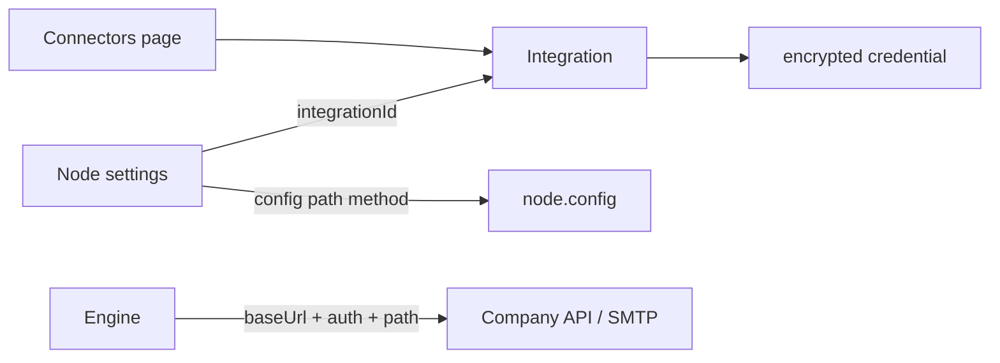

# Backend roadmap + Connectors UI design

## Locked decisions

- Next.js **does not** execute workflows (enqueue only).
- **Connectors page** = where HR pastes connection secrets / base URLs once.
- **Node settings** = where HR picks which connector + path/params for that step.
- Engine uses `Integration.baseUrl` + decrypted credential + `node.config` — no hardcoded mock `.NET`.

---

## Where you are now

| Area | Status |
|------|--------|
| UI + React Flow + NODE_CATALOG | Done ([`workflow.ts`](apps/web/src/lib/workflow.ts)) |
| Phase 1 Prisma/Neon | Done |
| `/api/workflows` CRUD | Partially done |
| `/api/integrations` + Connectors page | **Not built** |
| `/api/workflows/[id]/run` + worker | Not built |

---

## PHASE 2 — How Connectors work (design freeze)

### Split of responsibility

```text
CONNECTORS PAGE (once per company system)
  → name, type, baseUrl / host, auth secrets
  → saved as Integration + IntegrationCredential

BUILDER NODE SETTINGS (per node)
  → dropdown: which Integration?
  → method, path, query, email template, etc. in node.config
  → saves WorkflowNode.integrationId + config JSON
```



**Rule:** Secrets and base URL live on the **connector**. Paths and business params live on the **node**. Never put API keys in node config.

---

### Connector types on the UI (three cards / add forms)

#### 1. REST_API — “Company HR API”

Use for almost all HR_DATA + HTTP actions.

| Field on Connectors page | Required | Stored as |
|--------------------------|----------|-----------|
| Display name | yes | `Integration.name` |
| Base URL | yes | `Integration.baseUrl` e.g. `https://hr.company.com` |
| Auth type | yes | `CredentialType`: `API_KEY` \| `BEARER` \| `BASIC` \| `CUSTOM_JSON` |
| API key / Bearer token / user+password | yes | `encryptedData` |
| Optional default headers JSON | no | `Integration.config.headers` |
| Status | — | ACTIVE / DISABLED |

**Not on Connectors page:** `/api/attendance/monthly` — that is node `config.path`.

#### 2. SMTP — “Email / notifications”

Use for `SEND_EMAIL`.

| Field | Required | Stored as |
|-------|----------|-----------|
| Display name | yes | name |
| Host | yes | `config.host` or baseUrl-style |
| Port | yes | `config.port` |
| Secure (TLS) | yes | `config.secure` |
| Username | yes | credential |
| Password / app password | yes | encrypted |
| From address | yes | `config.from` |

#### 3. WEBHOOK — “Outgoing webhook destination” (V1 light)

Use for `SEND_WEBHOOK` if not using a generic REST connector.

| Field | Required | Stored as |
|-------|----------|-----------|
| Display name | yes | name |
| Target URL | yes | `baseUrl` (full URL allowed) |
| Optional secret / header | no | credential / config |

Incoming trigger webhooks stay on `WorkflowTrigger.config` (later) — not this Connectors form.

---

### Node → connector matrix (every catalog type)

From [`NODE_CATALOG`](apps/web/src/lib/workflow.ts):

#### Needs REST_API connector (+ path in node config)

| Node type | Typical path (node.config) | Extra node fields |
|-----------|----------------------------|-------------------|
| `GET_EMPLOYEES` | `/api/employees` | — |
| `GET_EMPLOYEE` | `/api/employees/{id}` | employeeId / template |
| `GET_ATTENDANCE` | `/api/attendance` | query period |
| `GET_MONTHLY_ATTENDANCE` | `/api/attendance/monthly` | period |
| `GET_LEAVE_RECORDS` | `/api/leave` | — |
| `GET_CANDIDATES` | `/api/candidates` | — |
| `GET_CANDIDATE` | `/api/candidates/{id}` | candidateId |
| `GET_ASSESSMENT_RESULT` | `/api/assessments/{id}` | assessmentId |
| `GET_INTERVIEWERS` | `/api/interviewers` | — |
| `GET_INTERVIEWER_AVAILABILITY` | `/api/interviewers/availability` | interviewerId |
| `HTTP_REQUEST` | user-defined path | method, body |
| `UPDATE_EMPLOYEE` | `/api/employees/{id}` | PATCH body map |
| `UPDATE_CANDIDATE_STATUS` | `/api/candidates/{id}/status` | status |
| `ASSIGN_INTERVIEWER` | `/api/interviews/assign` | body |
| `SCHEDULE_INTERVIEW` | `/api/interviews` | body |
| `CREATE_EMPLOYEE` | `/api/employees` | body |
| `CREATE_ONBOARDING_TASK` | `/api/onboarding/tasks` | body |

One company can use **one** REST connector for all of these (same `baseUrl`); each node only changes `path` / method.

#### Needs SMTP connector

| Node type | Node.config (not on Connectors) |
|-----------|----------------------------------|
| `SEND_EMAIL` | `to`, `subject`, `body` (templates like `{{employee.email}}`) |

#### Needs REST or WEBHOOK connector

| Node type | Notes |
|-----------|-------|
| `SEND_WEBHOOK` | Prefer REST connector + path, or dedicated WEBHOOK connector URL |

#### Needs **no** connector (`integrationId = null`)

| Node type | Why |
|-----------|-----|
| `MANUAL_TRIGGER`, `SCHEDULE`, `WEBHOOK`, `ASSESSMENT_COMPLETED`, `CANDIDATE_HIRED` | Start the run; schedule/webhook config on Trigger later |
| `CONDITION`, `FILTER`, `FOR_EACH`, `TRANSFORM_DATA`, `SWITCH`, `MERGE` | Pure logic in worker |
| `DELAY`, `LOG_RESULT`, confirmation-style utility | Local to engine |

Builder should **hide** connector picker for these types.

---

### Connectors page UI (one page)

Route: `/dashboard/connectors` (link from dashboard “external HR integrations” card).

**Layout**

1. Header: “Connectors” + short line: “Connect your company APIs and email so workflow nodes can run.”
2. List of existing integrations (name, type badge, baseUrl/host masked, status, Edit / Disable / Delete).
3. **Add connector** — choose type first (REST / SMTP / Webhook), then show **only that type’s fields** (space for every required field above).
4. Secrets: password/API key inputs are write-only; edit form shows “•••••• leave blank to keep”.
5. Optional **Test connection** button → server pings `baseUrl` or SMTP handshake; never returns decrypted secret.

Preserve existing teal / glass dashboard look; one job per section (list vs add form).

---

### How a node uses a connector at runtime

```text
GET_MONTHLY_ATTENDANCE node
  integrationId → Integration (REST_API)
       baseUrl = https://hr.company.com
       credential = Bearer ***
  config = { "method": "GET", "path": "/api/attendance/monthly" }

Worker engine:
  GET https://hr.company.com/api/attendance/monthly
  Authorization: Bearer <decrypted>
```

```text
SEND_EMAIL node
  integrationId → Integration (SMTP)
  config = { "to": "{{employee.email}}", "subject": "...", "body": "..." }

Worker:
  connect SMTP host/port with decrypted user/pass
  send mail From = config.from on Integration
```

If `integrationId` missing on a node that requires one → `NodeExecution` FAILED with message: “Connect an Integration on the Connectors page and select it on this node.”

---

### APIs for Phase 2

- `GET/POST /api/integrations`
- `GET/PATCH/DELETE /api/integrations/[id]`
- Session-guarded; encrypt on write; `CREDENTIAL_SELECT_SAFE` on read

### Phase 2b (same milestone or immediately after)

In builder node properties panel:

- If node type requires connector → Integration dropdown (filter by REST vs SMTP)
- Fields for path / method / filter / email template
- Persist `integrationId` + `config` via existing workflow PUT

---

## Run Now flow (unchanged summary)

```text
Connectors first → bind nodes → Save
→ POST /api/workflows/:id/run
→ Execution QUEUED + Redis { executionId }
→ Worker claim RUNNING → engine → company API via connector
→ UI poll QUEUED → RUNNING → SUCCESS + NodeExecution logs
```

---

## Later phases (brief)

| Phase | Work |
|-------|------|
| 3 | Finish publish / `currentVersionId`; save `integrationId` |
| 4 | Run enqueue only |
| 5 | Worker claim + load |
| 6 | Engine per matrix above |
| 7 | Retry / stale / idempotency |
| 8 | Wire Run Now UI off simulation |

---

## Demo definition of done (Connectors + Run)

> Login → **Connectors**: add REST (baseUrl + API key) and SMTP → Low Attendance workflow → Get Attendance + Get Employee use REST connector + paths → Send Email uses SMTP → Save → Run Now → Queued → Running → Success → logs show API data / email step.
