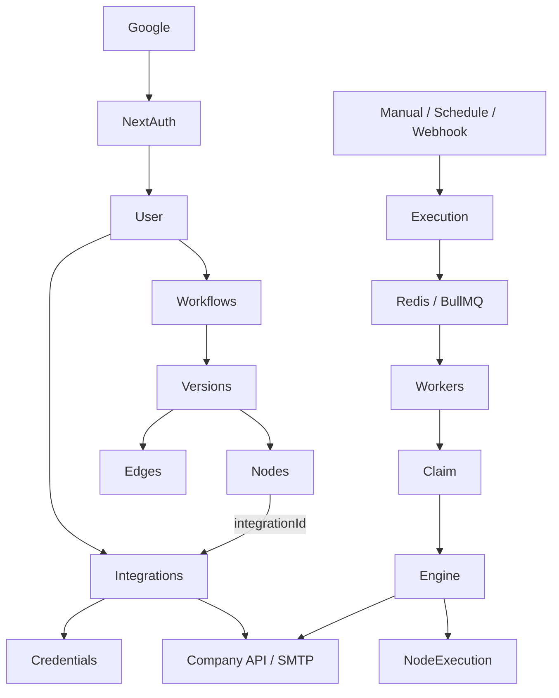

# V1 product schema architecture (freeze before Prisma)

This is the blueprint for `schema.prisma`. Entity list alone is not enough — the plan covers **lifecycle, multi-worker claim, duplicates, retries, stale jobs, idempotency, DB/queue failures, state transitions, concurrent updates, indexes, and delete policy**.

**Product stance:** HR connects their own API/SMTP/webhook via Integrations UI. Any company stack (including a local .NET during testing) is just a `baseUrl` — the schema does not depend on mock HR tables.

---

## 1. Whole system

```text
                         GOOGLE
                           │
                           ▼
                      NextAuth
                           │
                           ▼
                         USER
          ┌────────────────┼────────────────┐
          ▼                ▼                ▼
      WORKFLOWS       INTEGRATIONS      SETTINGS (later)
          │                │
          ▼                ▼
      VERSIONS       CREDENTIALS
          │
       ┌──┴──┐
       ▼     ▼
     NODES  EDGES ──integrationId──► INTEGRATION ──► COMPANY API / SMTP
```

**Execution side**

```text
Manual / Scheduler / Webhook
        │
        ▼
  CREATE EXECUTION → QUEUED → Redis/BullMQ
        │
   ┌────┼────┐
Worker Worker Worker
        │
        ▼
  ATOMIC CLAIM → RUNNING → Workflow Engine
        │
        ▼
  Node → Integration → External API → NodeExecution
        │
        ▼
  SUCCESS / FAILED (+ retry if needed)
```



**Layers**

| Layer | What | Store |
|-------|------|--------|
| 1 Product | User, Workflow, Version, Node, Edge, Trigger, Integration, Credential | Postgres |
| 2 State | Execution, NodeExecution, Worker (optional) | Postgres |
| 3 Queue | Jobs `{ executionId }` | Redis / BullMQ only |
| 4 Runtime | Worker + engine → user APIs | Processes |

---

## 2. USER

```text
User: id, name, email, image, createdAt, updatedAt
```

Owns: Workflows, Integrations. No Organization/Company/Workspace in V1.

---

## 3. NextAuth tables (separate from business logic)

```text
Account, Session, VerificationToken
Google → Account → User
```

---

## 4. WORKFLOW

```text
Workflow
────────────────
id
userId
name
description?
status              DRAFT | ACTIVE | ARCHIVED
currentVersionId?   → WorkflowVersion (published pointer)
createdAt
updatedAt
```

**Why `currentVersionId`:** many versions exist; this points at the live published graph for Run / Schedule / Webhook.

**Status transitions (enforced in service logic, not free-form):**

```text
DRAFT → ACTIVE → ARCHIVED
```

Prefer **ARCHIVE** over hard-delete for production workflows.

---

## 5. WORKFLOW VERSION (keep — historical correctness)

```text
WorkflowVersion
────────────────────
id
workflowId
versionNumber
status              DRAFT | PUBLISHED | ARCHIVED
createdById → User
createdAt
publishedAt?
```

**Unique:** `(workflowId, versionNumber)`

Yesterday’s run at 75% stays on Version 2 even if HR edits threshold to 80% today on Version 3.

**Publish rule:** create/publish new version; do not mutate published nodes in place. App ensures at most one `PUBLISHED` (or use `currentVersionId` as the single source of “live”).

---

## 6–8. NODES, CONFIG (JSON), EDGES

```text
WorkflowNode
────────────────────
id
workflowVersionId
type                String (extensible)
name
integrationId?      → Integration (null for Filter/Condition/Transform)
config              Json
positionX
positionY
createdAt
updatedAt
```

**Config examples (schema stays stable):**

- Get Attendance: `{ "method": "GET", "path": "/attendance/monthly", "query": { "period": "current_month" } }`
- Condition: `{ "field": "attendance.percentage", "operator": "LESS_THAN", "value": 75 }`
- Send Email: `{ "to": "{{employee.email}}", "subject": "...", "body": "..." }`
- Retry hints (optional in config): `{ "maxAttempts": 3, "backoff": "exponential" }`

```text
WorkflowEdge
────────────────────
id
workflowVersionId
sourceNodeId
targetNodeId
sourceHandle?       e.g. "true" | "false" for IF branches
targetHandle?
```

FK nodes must belong to the same version (API enforcement).

---

## 9. WORKFLOW TRIGGER

```text
WorkflowTrigger
────────────────────
id
workflowId
type                MANUAL | SCHEDULE | WEBHOOK | ASSESSMENT_COMPLETED | CANDIDATE_HIRED
config              Json
enabled
createdAt
updatedAt
```

Schedule config **must** include timezone:

```json
{ "cron": "30 9 * * *", "timezone": "Asia/Kolkata" }
```

Webhook V1 config in trigger JSON is enough; dedicated `WebhookEndpoint` table later.

**All triggers converge:** create Execution → QUEUED → same queue/worker path.

---

## 10–12. INTEGRATION + CREDENTIAL + node link

```text
Integration
────────────────────
id, userId, name
type                REST_API | SMTP | WEBHOOK
baseUrl?
config              Json
status              ACTIVE | DISABLED | ERROR
createdAt, updatedAt
```

```text
IntegrationCredential
────────────────────────
id, integrationId
type                API_KEY | BASIC | BEARER | SMTP | CUSTOM_JSON
encryptedData
createdAt, updatedAt
```

**Node → Integration:** direct `WorkflowNode.integrationId` (no join table). Null for pure logic nodes.

**Credential rule:** browser never receives decrypted secrets. UI creates → backend encrypts → Postgres. Worker decrypts server-side only to call the API.

---

## 13–15. EXECUTION (+ input / output)

```text
Execution
────────────────────────
id
workflowId
workflowVersionId
triggerType
status              QUEUED | RUNNING | SUCCESS | FAILED | CANCELLED
input               Json?     // trigger payload
output              Json?     // final summary e.g. emailsSent
attempt             Int default 1
workerId?
lockedAt?
heartbeatAt?
startedAt?
finishedAt?
error?
idempotencyKey?     // short-lived Run API dedupe (unique when set)
createdAt
updatedAt
```

**Execution state transitions:**

```text
QUEUED → RUNNING → SUCCESS
QUEUED → RUNNING → FAILED
QUEUED | RUNNING → CANCELLED
```

**Why input/output:** webhook vs manual payloads differ; UI can show “24 employees matched / 24 emails sent” from `output`.

---

## 16–17. NODE EXECUTION (logs + reproducibility)

```text
NodeExecution
──────────────────────
id
executionId
nodeId → WorkflowNode
status              PENDING | RUNNING | SUCCESS | FAILED | SKIPPED
attempt
input               Json?   // actual config/payload used this run
output              Json?
error?
startedAt?
finishedAt?
durationMs?
```

**Unique V1:** `(executionId, nodeId, attempt)`

Pins historical meaning via `workflowVersionId` on Execution; captures what actually ran in `input`/`output` without cloning the whole graph onto Execution.

Maps to `execution-log-drawer.tsx`.

---

## 18. QUEUE (not Prisma)

Postgres = source of truth. Redis/BullMQ = queue only.

Payload:

```json
{ "executionId": "exec_5001" }
```

No BullMQ tables in Prisma.

---

## 19–21. WORKER + claim + concurrency

Optional:

```text
Worker: id, workerId (unique), status ONLINE|OFFLINE, lastHeartbeatAt, startedAt, metadata Json?
```

Claim fields live on **Execution** (`workerId`, `lockedAt`, `heartbeatAt`) — Worker is health only, not execution truth.

**Atomic claim (critical for multi-worker):**

```sql
UPDATE "Execution"
SET status = 'RUNNING',
    "workerId" = $worker,
    "lockedAt" = NOW(),
    "heartbeatAt" = NOW(),
    "startedAt" = NOW()
WHERE id = $id AND status = 'QUEUED'
```

1 row → this worker owns it. 0 rows → another worker already claimed; stop.

While RUNNING, worker refreshes `heartbeatAt`. **Stale jobs:** RUNNING + old heartbeat → recovery (Phase 7): re-queue or fail safely.

---

## 22. Retry

- `Execution.attempt` / `NodeExecution.attempt`
- Optional `maxAttempts` / `backoff` in Workflow or node `config`
- Transient HTTP 503 → bump attempt → new NodeExecution row (same unique key with new attempt) or re-queue Execution

---

## 23. Idempotency (assignment requirement — lean V1)

**Do not** build a giant idempotency subsystem.

1. **Node uniqueness:** `(executionId, nodeId, attempt)` prevents duplicate step rows for the same attempt.
2. **Side-effect key (engine logic):** for emails etc. derive deterministic key  
   `executionId + nodeId + logicalItemId` (e.g. employee_101) → skip if already SUCCESS for that action.
3. **Duplicate Run Now:** `Idempotency-Key` header on `POST .../run` → store on `Execution.idempotencyKey` (unique when present); same key returns same execution.

Exact Prisma unique on side-effect keys can be a later `IdempotencyKey` table; V1 documents the strategy and uses Execution + NodeExecution constraints.

---

## 24–27. Duplicate Run / Schedule / Webhook

- Multiple **legitimate** runs allowed (different keys / no key).
- Accidental double-submit blocked by Idempotency-Key.
- Schedule and webhook create the same Execution shape; no separate execution architecture.
- Webhook secret/path uniqueness → later `WebhookEndpoint`; V1 = trigger `config` JSON.

---

## 28. State transitions summary

| Entity | Allowed |
|--------|---------|
| Workflow | DRAFT → ACTIVE → ARCHIVED |
| Version | DRAFT → PUBLISHED → ARCHIVED |
| Execution | QUEUED → RUNNING → SUCCESS \| FAILED; CANCELLED from QUEUED/RUNNING |
| NodeExecution | PENDING → RUNNING → SUCCESS \| FAILED \| SKIPPED |

Enforce in backend services.

---

## 29. Indexes (required access patterns)

```text
Workflow            index(userId)
WorkflowVersion     unique(workflowId, versionNumber); index(workflowId)
WorkflowNode        index(workflowVersionId); index(integrationId)
WorkflowEdge        index(workflowVersionId); index(sourceNodeId); index(targetNodeId)
WorkflowTrigger     index(workflowId); index(type, enabled)
Integration         index(userId)
IntegrationCredential index(integrationId)
Execution           index(workflowId); index(workflowVersionId); index(status, createdAt);
                    index(workerId); unique(idempotencyKey) where not null
NodeExecution       index(executionId); unique(executionId, nodeId, attempt)
Worker              unique(workerId)
```

---

## 30. Delete / cascade policy

| Parent | Child | Behavior |
|--------|-------|----------|
| User | Workflow, Integration | Cascade |
| Workflow | Version, Trigger | Cascade |
| WorkflowVersion | Node, Edge | Cascade |
| Integration | Credential | Cascade |
| Execution | NodeExecution | Cascade |
| Workflow → Execution | **Do not** hard-delete history on archive; prefer `ARCHIVED` workflow; if hard-delete needed later, soft-null or retain executions |

Draft wipe / republish: new Version + new nodes/edges; leave old published version immutable for past Executions.

---

## 31. Frozen V1 model set

```text
AUTH:         User, Account, Session, VerificationToken
WORKFLOW:     Workflow, WorkflowVersion, WorkflowNode, WorkflowEdge, WorkflowTrigger
INTEGRATION:  Integration, IntegrationCredential
EXECUTION:    Execution, NodeExecution
INFRA:        Worker (optional)
```

**Do not add in V1:** Organization, Company, Workspace, Team, RBAC, Dataset, mock HR tables, .NET tables, BullMQ tables.

---

## 32. Relationship diagram

```text
USER ──┬── WORKFLOW ──┬── TRIGGER
       │              ├── VERSION ── NODE ──► INTEGRATION
       │              │            └── EDGE
       │              └── EXECUTION ── NODE EXECUTION
       └── INTEGRATION ── CREDENTIAL
```

---

## 33. Execution / NodeExecution field groups

**Execution:** identity · workflow + version refs · trigger · status · input · output · attempt · worker claim · heartbeat · timing · error · idempotencyKey

**NodeExecution:** execution + node refs · status · attempt · input · output · error · timing · duration

Enough to explain **what happened**, not only that something finished.

---

## 34. Complete lifecycle (25 steps)

```text
1  Google login → 2 User
3  Create Integration → 4 Credential encrypted
5  Create Workflow → 6 Version → 7 Nodes/Edges → 8 integrationId on nodes
9  Publish (currentVersionId / PUBLISHED)
10 Manual | Schedule | Webhook
11 Create Execution (+ input, optional idempotencyKey)
12 QUEUED → 13 Redis/BullMQ → 14 Worker receives
15 Atomic claim → 16 RUNNING
17 Load version + graph → 18 Integration → 19 Credential decrypt
20 Execute node → 21 Save NodeExecution → 22 next node
23 SUCCESS / FAILED → 24 Retry if needed → 25 History in UI
```

---

## Implementation order (schema only first)

1. Scaffold [`packages/db`](packages/db) + Neon `DATABASE_URL`
2. Write `schema.prisma` exactly to this freeze
3. Indexes + uniques + cascades as above
4. `prisma migrate` against Neon (no mock-API seed)
5. Document encrypt helper + no-decrypt-to-client + claim SQL + Run Idempotency-Key
6. **Stop** before CRUD until schema review — then Integrations UI → workflow APIs → run/queue → worker → engine

---

## Explicitly deferred

- Mock `.NET` as product dependency (optional later as one Integration URL)
- `WebhookEndpoint` table, full `IdempotencyKey` table, org multi-tenant
- Storing queue state in Postgres
